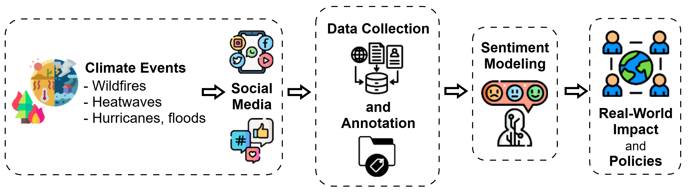

# ClimateSentiment: A Curated Paper List for Sentiment Analysis in Climate Events

This anonymous repository contains a curated list of research papers referenced in the [ACM Hypertext 2025] submission:  
“**Sentiment and Social Signals in the Climate Crisis**: A Survey on Analyzing Social Media Responses to Extreme Weather Events.”

📝 **Purpose**: To foster transparency, reproducibility, and community contribution during the double-blind review process.

📬 Feel free to open a pull request to suggest papers relevant to:
- Sentiment/emotion analysis
- Climate and weather events
- Misinformation and social media
- Large Language Models in annotation/modeling



📎 The repository will be updated continuously throughout the review period.

---

## 🔍 Browse Paper Categories

### Papers Covering Climate Change Effects on Environmental Sciences, Ecosystems, Extreme Events, Heat Stress, Urban Climate, and Thermal Exposure, Social Media and News Influence Studies, Linking Climate Change and Social Media, Evaluation Metrics & Sentiment Analysis Techniques


- `floranza2019impact` – *The Impact of Disasters and Climate Change on Migration and Displacement*  
- `gabric2023climate` – *The Climate Change Crisis: A Review of Its Causes and Possible Responses*  
- `sayigh2023global` – *Global Catastrophe: Climate Change Is Happening Now, Renewable Energy Can Reduce Its Impact*  
- `singh2023comprehensive` – *A Comprehensive Review on Climate Change and Its Effects*  
- `mostafa2025interconnected` – *Interconnected Impacts of Climate Change on Biodiversity, Agriculture, and Human Health*  
- `seneviratne2024extreme` – *Extreme Events and Land Use Changes in the Climate Crisis*  
- `mahmoodimpact` – *The Impact of Climate Change on Mental Health in Vulnerable Groups: A Systematic Review*  
- `ahmad2022climate` – *Climate Change: A Global Crisis*  
- `shi2018impact` – *Impact of Climate Change on the Global Environment and Associated Human Health*  
- `mair2011events` – *Events and Climate Change: An Australian Perspective*  
- `bracchetti2024mass` – *Mass Mortality Event of Mediterranean Mussels in the Middle Adriatic: Potential Implications of the Climate Crisis for Marine Ecosystems*  
- `carvalho2009reporting` – *Reporting the Climate Change Crisis*  
- `bergquist2019experiencing` – *Experiencing a Severe Weather Event Increases Concern About Climate Change*  
- `thomasimpacts` – *Impacts of Climate Change*  
- `dey2021natural` – *Natural Disasters Linked to Climate Change*  
- `adamopoulos2024climate` – *Climate Crises Associated with Epidemiological, Environmental, and Ecosystem Effects of a Storm (Storm Daniel, Greece)*  
- `kumar2024climate` – *Climate Change Impacts on Human Health*
- `turner2022cities` – *How Are Cities Planning for Heat? Analysis of U.S. Municipal Plans*  
- `middel2019micrometeorological` – *Micrometeorological Determinants of Pedestrian Thermal Exposure: Introducing the MaRTy Platform*  
- `guzman2024development` – *Adaptive Heat Stress Compensability Classification for the U.S.*  
- `karanja2024impact` – *Impact of Tent Shade on Heat Exposures and Heat Strain in Homeless Populations*  
- `huang2025outdoor` – *Outdoor Misting as an Effective Urban Heat Mitigation Solution*  
- `browning2024value` – *The Value and Urgency of Transportation Forestry*  
- `middel2023urban` – *Urban Climate Informatics* (Book)
- `alkhaled2024webmrt` – *WebMRT: A Machine Learning Tool for Predicting Mean Radiant Temperature*  
- `shaeri2025multimodal` – *A Multimodal Physics-Informed Neural Network Approach for Mean Radiant Temperature Modeling*
- `vsovsic2019influence` – Influence of Social Networks on National Television News Programmes  
- `chaudhary2025impact` – The Impact of New Media on Contemporary Journalism  
- `kobiruzzaman2022social` – Social media impact on traditional media  
- `bhat2024impact` – Impact of social media on society  
- `newman2009rise` – The rise of social media and its impact on mainstream journalism  
- `nagi2018new` – New social media and impact of fake news on society  
- `donoghue2016social` – Social media news as disruptive technology  
- `tapu2023review` – A Review on the Impacts of Social Media on the Mental Health  
- `luazuaroiu2014social` – The Social construction of participatory media technologies  
- `bastos2015shares` – Shares, pins, and tweets: News readership from daily papers to social media  
- `webb2021social` – Social Media and Fake News Impact on Social Movements  
- `lakzaei2025loss` – LOSS-GAT: Fake news detection via graph attention  
- `lakzaei2025neighborhood` – Neighborhood-Order Learning GAT for Fake News Detection  
- `lakzaei2025decision` – Decision-Based Heterogeneous GAT for Multi-Class Fake News  
- `lakzaei2024disinformation` – Disinformation detection using GNNs: A survey  
- `pranto2024satire` – Satire or Fake News? ML-Based Approaches  
- `pranto2023bad` – Private Data Use in Propagating Disinformation  
- `shaeri2023semi` – A Semi-supervised fake news detection using sentiment encoding and LSTM with Self-Attention 
- `beigi2024lrq` – LRQ-Fact: LLM-generated questions for fact-checking  
- `tan2024large` – LLMs for Data Annotation and Synthesis: A Survey  
- `li2024generation` – LLM-as-a-Judge: Opportunities and Challenges  
- `beigi2024model` – Model attribution in LLM-generated disinformation  
- `jeong2025fediversesharing` – FediverseSharing: Threads and Mastodon Interaction Dataset  
- `sultana2024systematic` – A systematic review of the nexus between climate change and social media  
- `mavrodieva2019role` – Role of social media in raising public awareness on climate  
- `vivion2024misinformation` – Misinformation about climate change on social media  
- `liao2024decoding` – Emotional and cognitive responses to climate change on social media  
- `olteanu2015comparing` – Comparing online news and social media coverage on climate events  
- `zein2024social` – Social media use for climate change campaigning in Indonesia  
- `hart2024climate` – Climate change advocacy on social platforms  
- `pupneja2023understanding` – Understanding climate opinions on social media  
- `yosipof2024cyber` – Climate change narratives on social media  
- `heo2022public` – Public perception of climate disasters through social media big data  
- `wang2024public` – Climate perception during COVID-19 crisis via social media in China  
- `pignot2023affective` – Emotional circulation of climate content online  
- `al2022covid` – Climate and COVID-19 meme discourse on social media  
- `makela2024climate` – Climate change storytelling through social media narratives  
- `al2019social` – How social media users link extreme events to climate change  
- `kokoschka2024visual` – Visual analytics of climate change in social media  
- `fernandez2016talking` – Communicating and engaging climate change through social media 
- `gimello2025embers` – Societal Impact of the LA Wildfires on Misinformation  
- `chappell2025fakeimages` – NPR Article on Fake AI Wildfire Images  
- `chicco2020advantages` – Advantages of MCC over F1  
- `liu2022sentiment` – Sentiment Analysis and Opinion Mining  
- `cambria2020senticnet` – SenticNet for Sentiment Tasks  
- sadik2022analyzing – Analyzing Climate Change Dialogue During California Wildfires
- ko2024experience – How the experience of California wildfires shape Twitter climate change framings
- michail2024incorporating – Incorporating Social Media Sensing and Computer Vision Technologies to Support Wildfire Monitoring
- garcia2024wildfires – Wildfires and social media discourse: exploring mental health and emotional wellbeing through Twitter
- lever2023human – Human-sensors & physics aware machine learning for wildfire detection and nowcasting
- lever2023social – Social & Physics Based Data Driven Methods for Wildfire Prediction
- gimello2025embers – From Embers to Rumors: Decoding the Societal Impact of the January 2025 Los Angeles Wildfires on Misinformation
- klariza2023impact – The impact of climate change on fire danger over the contiguous United States
- webb2016digital – Digital wildfires: hyper-connectivity, havoc and a global ethos to govern social media
- daniel2007people – People, fire, and forests: a synthesis of wildfire social science
- cortner2003humans – Humans, Fires, and Forests—Social science applied to fire management
- zamarreno2020social – Social-media analysis for disaster prevention: Forest fire in Artenara and Valleseco, Canary Islands
- corning2024flammable – Flammable futures—storylines of climatic impacts on wildfire events and palm oil plantations in Indonesia
- mocatta2020uncovering – Media coverage of Australia’s Black Summer bushfires and the climate blame frame
- gannon2021global – A global assessment of wildfire potential under climate change using Keetch-Byram drought index
- jolly2015climate – Climate-induced variations in global wildfire danger from 1979 to 2013
- winker2024wildfires – Wildfires and climate justice: Disproportionate impact on vulnerable communities in North Carolina
- sannigrahi2022examining – Forest fire emission in 2020 and connection to COVID-19 incidents on the US West Coast
- chulahwat2024impact – Wind characteristics and built environment damage during wildfire: the 2022 Marshall Fire
- sykas2023eo4wildfires – EO4WildFires: Benchmark dataset for wildfire impact prediction
- abatzoglou2013relationships – Relationships between climate and macroscale area burned in the western US
- `mostafa2025interconnected` – *Interconnected Impacts of Climate Change on Biodiversity, Agriculture, and Human Health*  
- `seneviratne2024extreme` – *Extreme Events and Land Use Changes in the Climate Crisis*  
- `mahmoodimpact` – *The Impact of Climate Change on Mental Health in Vulnerable Groups: A Systematic Review*  
- `ahmad2022climate` – *Climate Change: A Global Crisis*  
- `shi2018impact` – *Impact of Climate Change on the Global Environment and Associated Human Health*  
- `mair2011events` – *Events and Climate Change: An Australian Perspective*  
- `bracchetti2024mass` – *Mass Mortality Event of Mediterranean Mussels in the Middle Adriatic: Potential Implications of the Climate Crisis for Marine Ecosystems*  
- `carvalho2009reporting` – *Reporting the Climate Change Crisis*  
- `bergquist2019experiencing` – *Experiencing a Severe Weather Event Increases Concern About Climate Change*  
- `thomasimpacts` – *Impacts of Climate Change*  
- `dey2021natural` – *Natural Disasters Linked to Climate Change*  
- `adamopoulos2024climate` – *Climate Crises Associated with Epidemiological, Environmental, and Ecosystem Effects of a Storm (Storm Daniel, Greece)*  
- `kumar2024climate` – *Climate Change Impacts on Human Health*
- `turner2022cities` – *How Are Cities Planning for Heat? Analysis of U.S. Municipal Plans*  
- `middel2019micrometeorological` – *Micrometeorological Determinants of Pedestrian Thermal Exposure: Introducing the MaRTy Platform*  
- `guzman2024development` – *Adaptive Heat Stress Compensability Classification for the U.S.*  
- `karanja2024impact` – *Impact of Tent Shade on Heat Exposures and Heat Strain in Homeless Populations*  
- `huang2025outdoor` – *Outdoor Misting as an Effective Urban Heat Mitigation Solution*  
- `browning2024value` – *The Value and Urgency of Transportation Forestry*  
- `middel2023urban` – *Urban Climate Informatics* (Book)
- `alkhaled2024webmrt` – *WebMRT: A Machine Learning Tool for Predicting Mean Radiant Temperature*  
- `shaeri2025multimodal` – *A Multimodal Physics-Informed Neural Network Approach for Mean Radiant Temperature Modeling*
- `vsovsic2019influence` – Influence of Social Networks on National Television News Programmes  
- `chaudhary2025impact` – The Impact of New Media on Contemporary Journalism  
- `kobiruzzaman2022social` – Social media impact on traditional media  
- `bhat2024impact` – Impact of social media on society  
- `newman2009rise` – The rise of social media and its impact on mainstream journalism  
- `nagi2018new` – New social media and impact of fake news on society  
- `donoghue2016social` – Social media news as disruptive technology  
- `tapu2023review` – A Review on the Impacts of Social Media on the Mental Health  
- `luazuaroiu2014social` – The Social construction of participatory media technologies  
- `bastos2015shares` – Shares, pins, and tweets: News readership from daily papers to social media  
- `webb2021social` – Social Media and Fake News Impact on Social Movements  
- `lakzaei2025loss` – LOSS-GAT: Fake news detection via graph attention  
- `lakzaei2025neighborhood` – Neighborhood-Order Learning GAT for Fake News Detection  
- `lakzaei2025decision` – Decision-Based Heterogeneous GAT for Multi-Class Fake News  
- `lakzaei2024disinformation` – Disinformation detection using GNNs: A survey  
- `pranto2024satire` – Satire or Fake News? ML-Based Approaches  
- `pranto2023bad` – Private Data Use in Propagating Disinformation  
- `shaeri2023semi` – A Semi-supervised fake news detection using sentiment encoding and LSTM with Self-Attention 
- `beigi2024lrq` – LRQ-Fact: LLM-generated questions for fact-checking  
- `tan2024large` – LLMs for Data Annotation and Synthesis: A Survey  
- `li2024generation` – LLM-as-a-Judge: Opportunities and Challenges  
- `beigi2024model` – Model attribution in LLM-generated disinformation  
- `jeong2025fediversesharing` – FediverseSharing: Threads and Mastodon Interaction Dataset  
- `sultana2024systematic` – A systematic review of the nexus between climate change and social media  
- `mavrodieva2019role` – Role of social media in raising public awareness on climate  
- `vivion2024misinformation` – Misinformation about climate change on social media  
- `liao2024decoding` – Emotional and cognitive responses to climate change on social media  
- `olteanu2015comparing` – Comparing online news and social media coverage on climate events  
- `zein2024social` – Social media use for climate change campaigning in Indonesia  
- `hart2024climate` – Climate change advocacy on social platforms  
- `pupneja2023understanding` – Understanding climate opinions on social media  
- `yosipof2024cyber` – Climate change narratives on social media  
- `heo2022public` – Public perception of climate disasters through social media big data  
- `wang2024public` – Climate perception during COVID-19 crisis via social media in China  
- `pignot2023affective` – Emotional circulation of climate content online  
- `al2022covid` – Climate and COVID-19 meme discourse on social media  
- `makela2024climate` – Climate change storytelling through social media narratives  
- `al2019social` – How social media users link extreme events to climate change  
- `kokoschka2024visual` – Visual analytics of climate change in social media  
- `fernandez2016talking` – Communicating and engaging climate change through social media 
- `gimello2025embers` – Societal Impact of the LA Wildfires on Misinformation  
- `chappell2025fakeimages` – NPR Article on Fake AI Wildfire Images  
- `chicco2020advantages` – Advantages of MCC over F1  
- `liu2022sentiment` – Sentiment Analysis and Opinion Mining  
- `cambria2020senticnet` – SenticNet for Sentiment Tasks  
- sadik2022analyzing – Analyzing Climate Change Dialogue During California Wildfires
- ko2024experience – How the experience of California wildfires shape Twitter climate change framings
- michail2024incorporating – Incorporating Social Media Sensing and Computer Vision Technologies to Support Wildfire Monitoring
- garcia2024wildfires – Wildfires and social media discourse: exploring mental health and emotional wellbeing through Twitter
- lever2023human – Human-sensors & physics aware machine learning for wildfire detection and nowcasting
- lever2023social – Social & Physics Based Data Driven Methods for Wildfire Prediction
- gimello2025embers – From Embers to Rumors: Decoding the Societal Impact of the January 2025 Los Angeles Wildfires on Misinformation
- klariza2023impact – The impact of climate change on fire danger over the contiguous United States
- webb2016digital – Digital wildfires: hyper-connectivity, havoc and a global ethos to govern social media
- daniel2007people – People, fire, and forests: a synthesis of wildfire social science
- cortner2003humans – Humans, Fires, and Forests—Social science applied to fire management
- zamarreno2020social – Social-media analysis for disaster prevention: Forest fire in Artenara and Valleseco, Canary Islands
- corning2024flammable – Flammable futures—storylines of climatic impacts on wildfire events and palm oil plantations in Indonesia
- mocatta2020uncovering – Media coverage of Australia’s Black Summer bushfires and the climate blame frame
- gannon2021global – A global assessment of wildfire potential under climate change using Keetch-Byram drought index
- jolly2015climate – Climate-induced variations in global wildfire danger from 1979 to 2013
- winker2024wildfires – Wildfires and climate justice: Disproportionate impact on vulnerable communities in North Carolina
- sannigrahi2022examining – Forest fire emission in 2020 and connection to COVID-19 incidents on the US West Coast
- chulahwat2024impact – Wind characteristics and built environment damage during wildfire: the 2022 Marshall Fire
- sykas2023eo4wildfires – EO4WildFires: Benchmark dataset for wildfire impact prediction
- abatzoglou2013relationships – Relationships between climate and macroscale area burned in the western US

li2020trends – Trends in lightning fires and smoke concentrations in response to climate change
---

## 📎 BibTeX File

You can download or browse the full `.bib` file used for citations in this project:  
👉 [`references.bib`](./references.bib)

---

## 📢 Contributions

You're welcome to suggest papers via Pull Request. Use the structure below:

```bibtex
@article{yourbibkey2025xyz,
  title={Paper Title},
  author={Author A and Author B},
  journal={Journal Name},
  year={2025},
  ...
}
```
---
